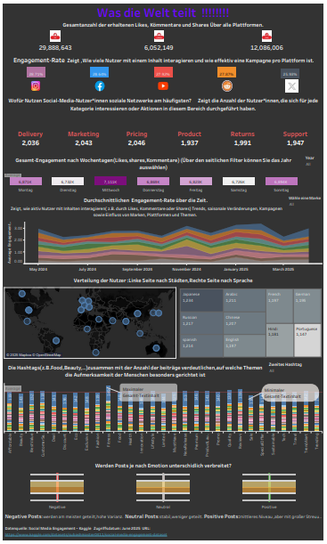

## Social-Media-Dashboard

Tableau dashboard analyzing social media engagement across platforms

Explore the live dashboard here (Final Version):
https://public.tableau.com/views/SocialMediaInteraction/Socialinteraction?:language=en-US

This Tableau dashboard provides insights into social media engagement across major platforms.
It visualizes key metrics such as Likes, Shares, and Comments, and helps identify which platforms, topics, and time periods generate the highest interaction.

## 📌Features (Final Version)

KPI tiles showing platform performance

Topic-based activity (Pricing, Product, Support, Marketing, etc.)

Filters for Year, City, and Language

Trends over time, weekday activity, and hashtag usage

Files

Social Interaction.twbx — Tableau dashboard (final)

Social interaction Final.pdf — full documentation (final)

The dashboard supports data-driven decisions in marketing, content strategy, and user engagement.

## 🕘 Old Version (v0.9)

This earlier version represents the first design iteration with:

Dark theme

Basic KPIs

Simpler layout and visual structure

Old Dashboard Screenshot

Live Tableau Link (Old Version):

https://public.tableau.com/views/FirstSocialMediaEngagement/MainDashboard

Files included in /v0.9_Old/

First Social Media Engagement.twbx — old Tableau workbook

Social Media Engagement.pdf — documentation for the old version
 
##  Deutsche Beschreibung

Eine ausführliche Erklärung des Dashboards finden Sie in der beigefügten PDF-Datei:
Social interaction Final.pdf
