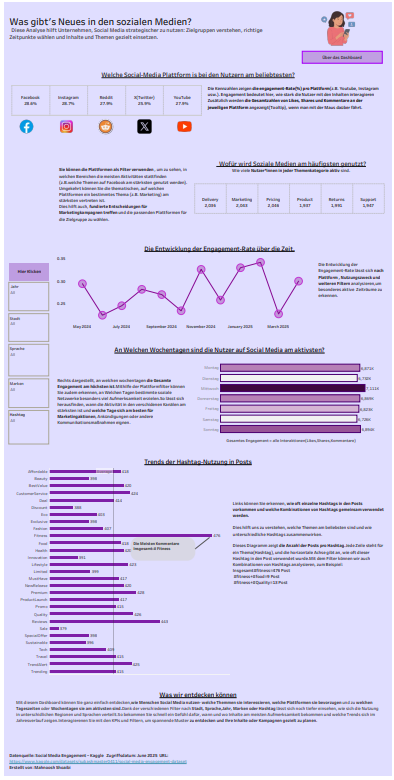

Social-Media-Dashboard

Tableau dashboard analyzing social media engagement across platforms

Explore the live dashboard here (Final Version):
https://public.tableau.com/views/SocialMediaInteraction/Socialinteraction?:language=en-US

This Tableau dashboard provides insights into social media engagement across major platforms.
It visualizes key metrics such as Likes, Shares, and Comments, and helps identify which platforms, topics, and time periods generate the highest interaction.

📌 Features (Final Version)

KPI tiles showing platform performance

Topic-based activity (Pricing, Product, Support, Marketing, etc.)

Filters for Year, City, and Language

Trends over time, weekday activity, and hashtag usage

Files

Social Interaction.twbx — Tableau dashboard (final)

Social interaction Final.pdf — full documentation (final)

The dashboard supports data-driven decisions in marketing, content strategy, and user engagement.

🕘 Old Version (v0.9)

This earlier version represents the first design iteration with:

Dark theme

Basic KPIs

Simpler layout and visual structure

Old Dashboard Screenshot

Live Tableau Link (Old Version):

https://public.tableau.com/views/FirstSocialMediaEngagement/MainDashboard

Files included in /v0.9_Old/

First Social Media Engagement.twbx — old Tableau workbook

Social Media Engagement.pdf — documentation for the old version

Ss_first.png — screenshot of the old dashboard

🇩🇪 Deutsche Beschreibung

Eine ausführliche Erklärung des Dashboards finden Sie in der beigefügten PDF-Datei:
Social interaction Final.pdf

Want me to also rewrite the old README so both versions match in style? 😊
You said:
did you think it is too long
ChatGPT said:

Honestly? Your README is still completely fine — not too long, not overwhelming.
It looks like a clean, professional project overview that includes:

Final version (main focus)

Old version (short summary + screenshot)

Links + files

German note

Nothing feels excessive.

BUT — if you want it shorter, I can tighten the old version section so it's very compact while still informative.

Here is a shorter, cleaner version you can use instead:

🕘 Old Version (v0.9)

Early prototype of the dashboard with a darker theme and simpler KPIs.

Old Dashboard Screenshot:

Live Link:
https://public.tableau.com/views/FirstSocialMediaEngagement/MainDashboard

Files:
v0.9_Old/ → workbook, PDF explanation, and screenshot

